# Đồ án môn học: Phát triển ứng dụng

## Giới thiệu ứng dụng

Ứng dụng quản lý cửa hàng sách bao gồm các chức năng lập hóa đơn, nhập hàng, quản lý thông tin nhân viên của cửa hàng, thông tin khách hàng, quản lý đổi trả, quản lý chương trình khuyến mãi của cửa hàng, quản lý các đầu sách/văn phòng phẩm, xem các thông tin thống kê cơ bản, tạo các báo cáo (kiểm tiền/kết toán) cho nhân viên quầy.

## Công nghệ sử dụng

- **Application**: Java Swing
- **Database**: Microsoft SQL Server

## Cấu hình phù hợp

- **JDK**: 17+
- **JRE**: 1.8
- **Database**: Microsoft SQL Server

## Tài liệu và Demo

- **Tài liệu phát triển dự án**: [Xem tại đây](https://github.com/iamKhang/omega-book/tree/main/documents)
- **Video demo chương trình**: [Xem trên YouTube](https://youtu.be/wFw2dgmIM5k?si=Y10pS1KcfCvRDZIM)

---

## Hiện thực

### 1) Chức năng bán hàng (lập hóa đơn)

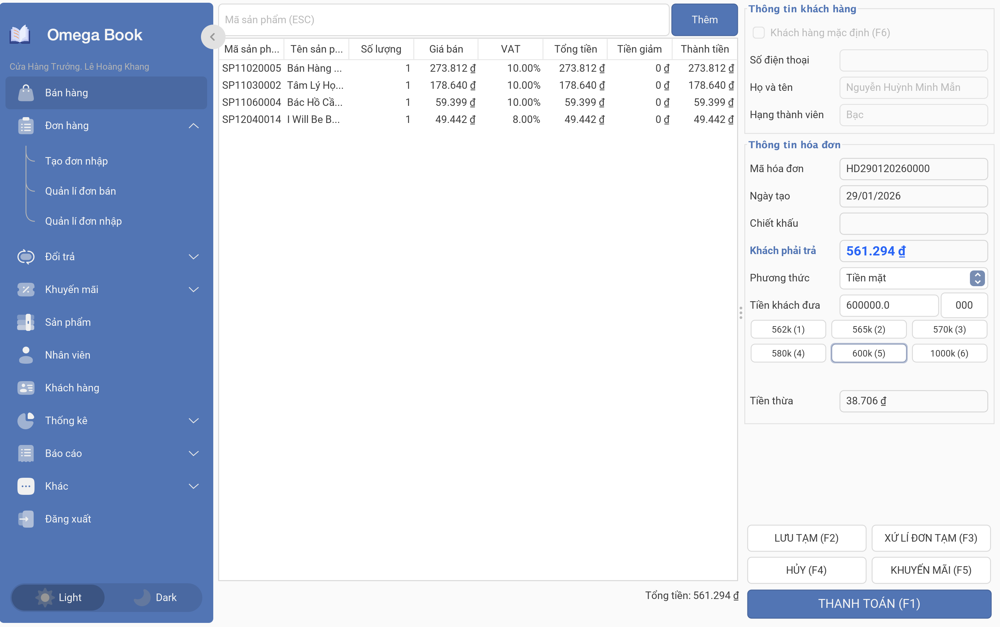

### 2) Quản lý đơn hàng bao gồm quản lý hóa đơn bán hàng và quản lý đơn nhập hàng

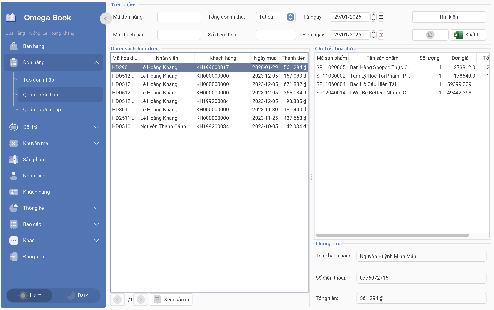

### 3) Quản lý đơn đổi hàng/trả hàng

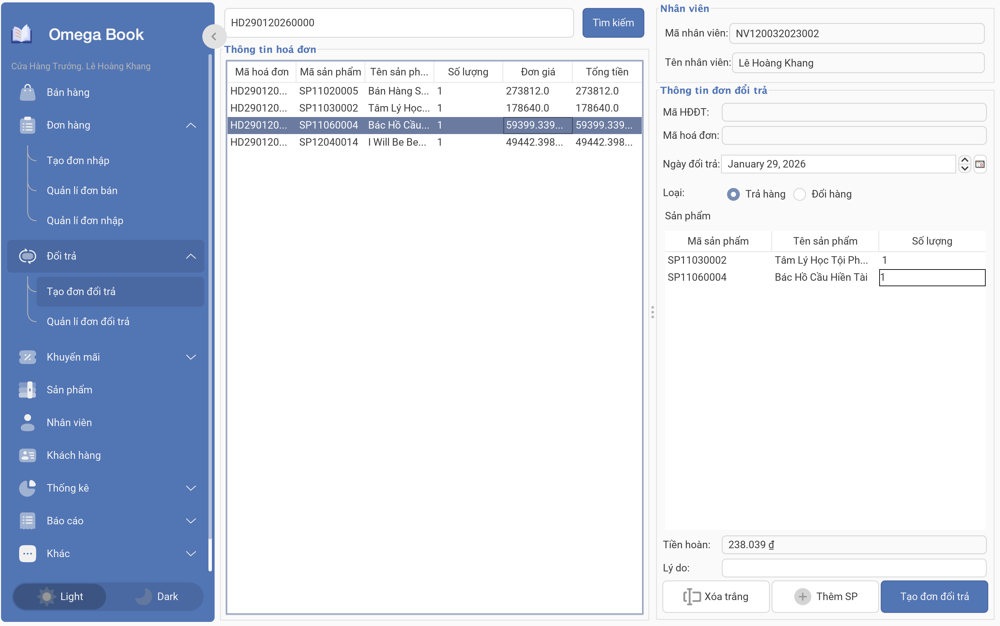

### 4) Quản lý chương trình khuyến mãi (Khuyến mãi theo phần trăm tổng hóa đơn và chương trình khuyến mãi theo sản phẩm cụ thể)

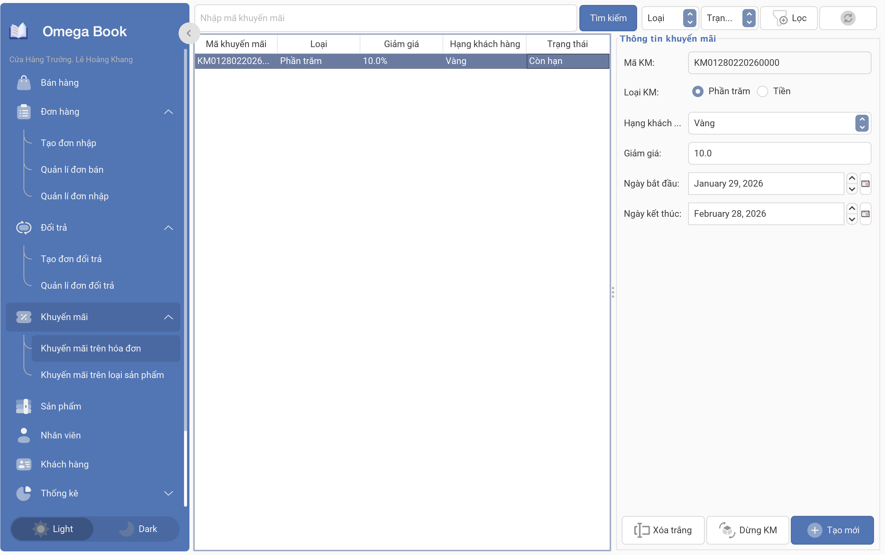

### 5) Quản lý sản phẩm (các đầu sách/văn phòng phẩm tại hiệu sách)

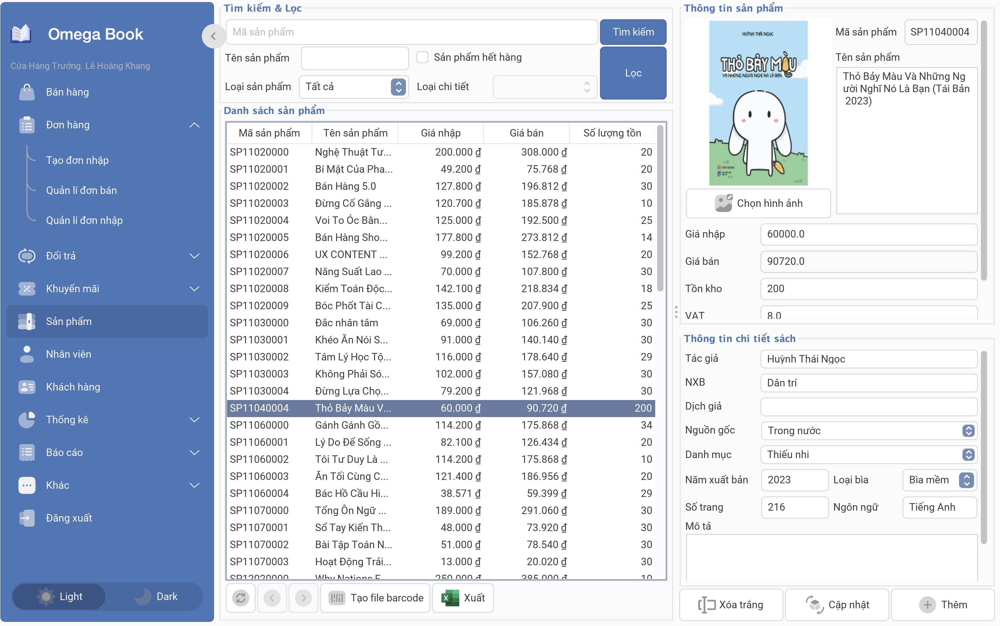

### 6) Quản lý thông tin nhân viên

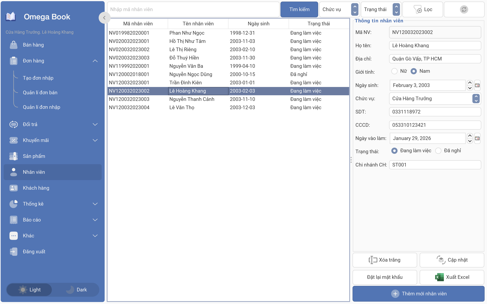

### 7) Quản lý thông tin khách hàng

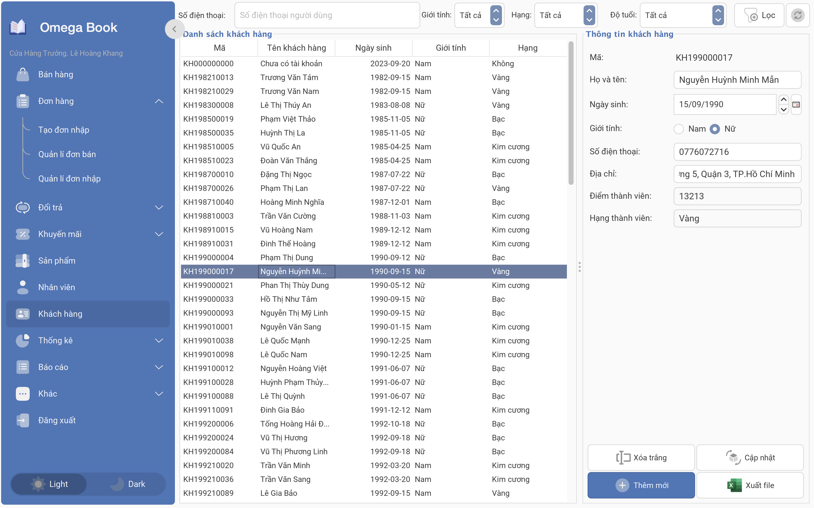

### 8) Xem các loại thống kê

#### Thống kê theo doanh thu

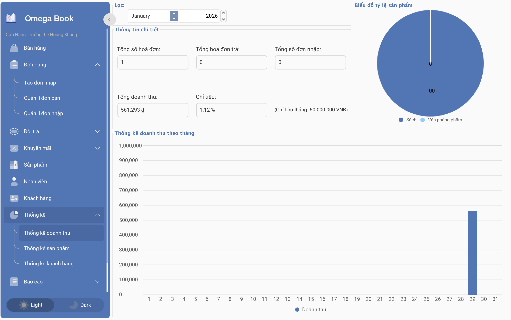

#### Thống kê theo sản phẩm

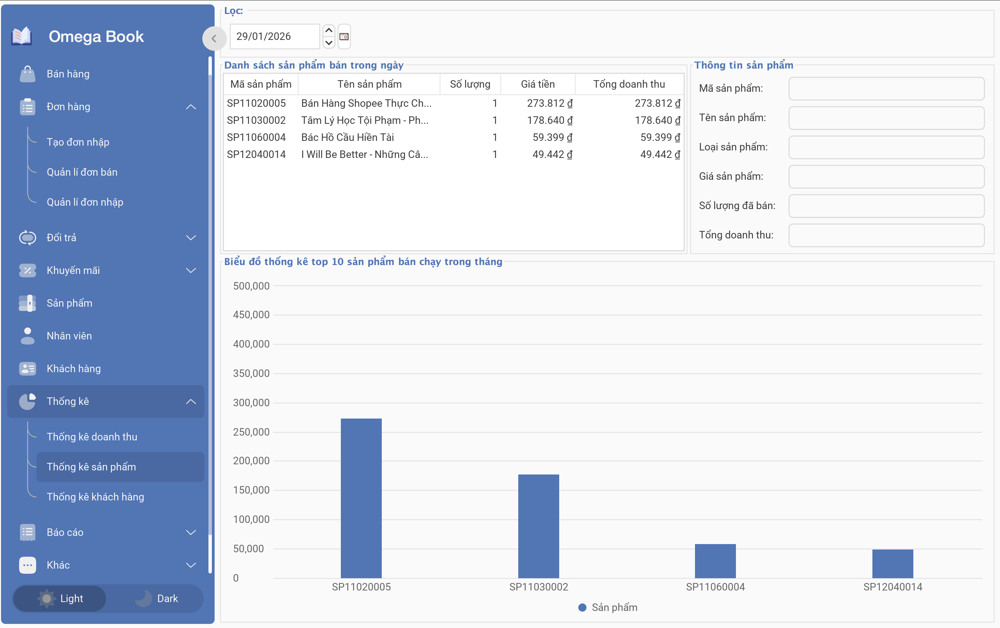

#### Thống kê theo khách hàng

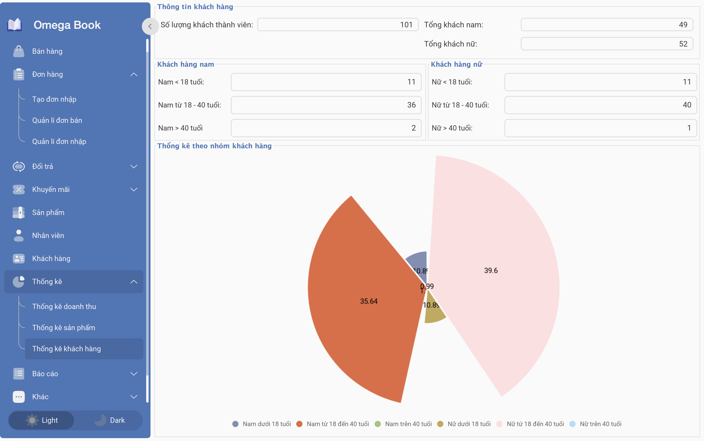

### 9) Tạo lập báo cáo: hỗ trợ nhân viên đứng quầy khi kết ca và bàn giao ca

#### Kiểm tiền

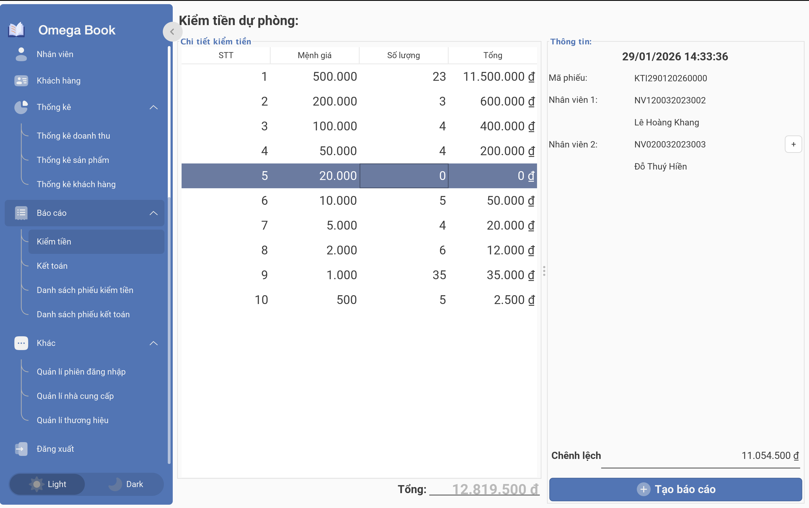

#### Kết toán

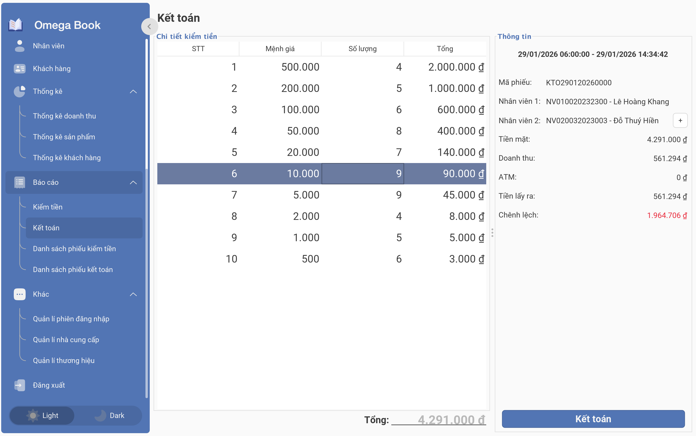

---

## Hướng dẫn cài đặt ứng dụng

### I. ĐỐI VỚI NGƯỜI DÙNG

1. Cài đặt JRE và MSSQL
2. Mở script `scripts_data.sql` ở `./src/database` và chạy để khởi tạo cơ sở dữ liệu
3. Sau đó mở `omegabook.jar` để bắt đầu sử dụng ứng dụng

### II. ĐỐI VỚI LẬP TRÌNH VIÊN

Project hoạt động tốt trên **Apache NetBeans IDE 18**

1. Cài đặt các JDK, MSSQL và IDE phù hợp
2. Chạy `scripts_data.sql` để khởi tạo cơ sở dữ liệu
3. Import project vào IDE và tiếp tục phát triển ứng dụng
